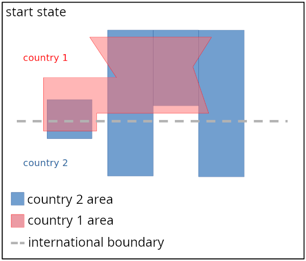
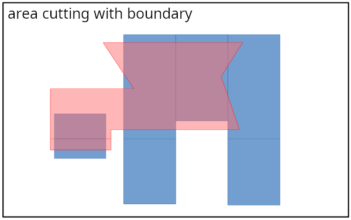
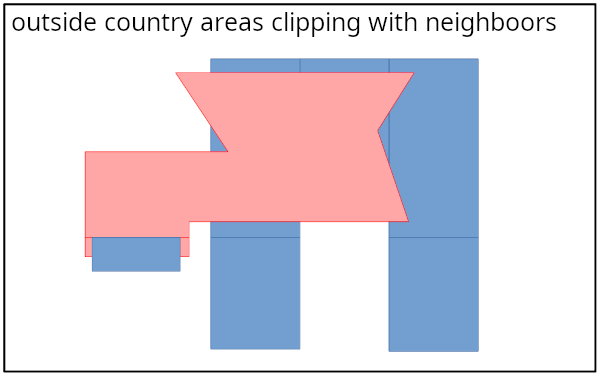
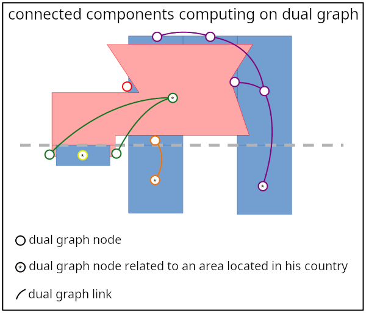
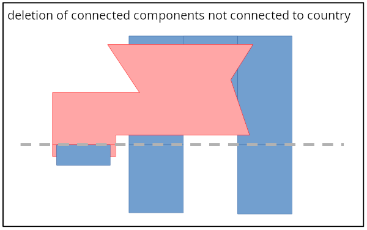
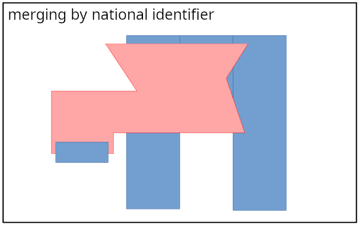
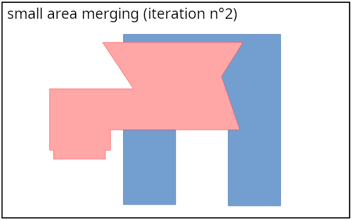

# Introduction

La présente documentation, à destination des développeurs, a pour objectif de présenter le détail du fonctionnement du processus de mise en cohérences des données de type surfacique aux frontières ainsi que les principaux outils mis en oeuvre.

# Installation

## Code source 

Le code source de l'application est disponible sur le dépôt [area_matching](https://github.com/openmapsforeurope2/area_matching.git)

## Dépendances 

L'installation de l'application nécessite la compilation préalable de bibliothèques internes et externes à l'IGN.

Voici le graphe des dépendances :


### Socle IGN 

Le socle logiciel de l'IGN regroupe un ensemble de bibliothèques développées en interne qui permettent d'unifier l'accès aux bibliothèques c++ de traitement et de stockage de données géographiques.
On y trouve notamment des modèles de données pivots (géométries, objet attributaire), des fonctions de lecture/écriture de conteneurs d'objets, des opérations sur les géométries, de nombreux algorithmes et outils spécifiquement conçus pour répondre à des problématiques géomaticiennes...

Le code source du socle ce trouve sur le dépôt [sd-socle](http://gitlab.forge-idi.ign.fr/socle/sd-socle.git)

### LibEPG 

Cette bibliothèque, développée à l'IGN et s'appuyant essentiellement sur le socle logiciel, contient de nombreux algorithmes et fonctions utilitaires dédiés spécifiquement aux besoins des produits européens (EGM/ERM) ainsi qu'au projet [OME2](https://github.com/openmapsforeurope2/OME2).
Elle comporte essentiellement des fonctions de généralisations, des fonctions utiles au management du processus tels que des utilitaires de log, d'orchestration, de gestion du contexte).
On y trouve également des opérateurs permettant d'encapsuler des objets géométriques complexes afin d'en optimiser la manipulation (par l'utilisation de graphes, d'indexes...) et ainsi d'accroitre les performances globales des processus.

Le code source de la bibliothèque libepg ce trouve sur le dépôt [libepg](https://github.com/IGNF/libepg.git)


# Fonctionnement du processus

Le traitement de raccordement des objets surfaciques est lancé pour un couple de pays frontaliers.

## Etapes préliminaires

Les données sur lesquelles ce traitement est lancé doivent avoir été nettoyées en amont à l'aide de l'outil **clean** du projet [data-tools](https://github.com/openmapsforeurope2/data-tools) qui permet de supprimer les objets trop éloignés de leur pays.
Cet outil doit être utilisé sur des tables de travail dans lesquelles sont extraites les données des deux pays à traiter autour de leur frontière commune.


## Principe général du traitement

Le processus de mise en cohérence des réseaux est décomposé en une succession d'étapes clés.
Afin d'orchestrer l'enchainement de ces étapes l'application utilise l'outil **epg::step::StepSuite** de la bibliothèque **libepg**. Ce dernier permet de lancer une succession de **epg::step::Step** dans lesquels sont implémentés les traitements de chaque étape.
Un code (numéro à trois chiffres) est attribué à chaque étape. Les étapes sont ordonnancées selon cette numérotation. Si une étape transforme les données sur lesquelles elle travaille, une ou plusieurs tables dédiées préfixées du code de l'étape sont créées. Ces créations sont réalisées en copiant les tables d'une étape antérieure (qui n'est pas nécessairement l'étape immédiatement antérieure, car toutes les étapes ne travaillent pas sur les mêmes données).
Ce fonctionnement permet de conserver les résultats intermédiaires du processus. Cela donne la possibilité d'arrêter et de reprendre le traitement en cours de processus et facilite le travail de d'analyse et de deboggage.


Les étapes qui composent le traitement de raccordement sont les suivantes :

**410** - découpe des surfaces des deux pays avec les frontières
<br>

********************************************************************
********************************************************************
********************************************************************
********************************************************************
********************************************************************
********************************************************************confirmer la phrase ci-dessous
**420** - pour les surfaces hors pays, on soustrait les portions de surface superposées aux surfaces du pays hôte.
<br>
**425** - suppression des surfaces hors pays isolées (non connectés directement ou indirectement avec une surface dans le pays)
<br>
**430** - fusion des surfaces en fonction du pays d'origine, de l'identifiant et le la longeur de zone de contact.


L'outil **epg::step::StepSuite** donne la possibilité de ne lancer que certaines étapes ou une plage de plusieurs étapes.

## Configuration

L'outil s'appuie sur de nombreux paramètres de configuration permettant d'adapter le comportement des algorithmes en fonctions des spécificités nationales (sémantique, précision, échelle, conventions de modélisation...).

On trouve dans le [dossier de configuration](https://github.com/openmapsforeurope2/area_matching/tree/main/config) les fichiers suivants :

- epg_parameters.ini : regroupe des paramètres de base issus de la bibliothèque libepg qui constitue le socle de développement l'outil. Ce fichier est aussi le fichier chapeau qui pointe vers les autres fichiers de configurations.
- db_conf.ini : informations de connexion à la base de données.
- theme_parameters_drainage_basin.ini : configuration des paramètres spécifiques au traitement des données de la classe __drainage_basin__.
- theme_parameters_glacier_snowfield.ini : configuration des paramètres spécifiques au traitement des données de la classe __glacier_snowfield__.


## Lancement du traitement

L'outil s'utilise en ligne de commande.
Le traitement peut être lancé sur deux types de données surfaciques :
- bassin versant (code drainage_basin)
- glacier (code glacier_snowfield)

<br>

Les paramètres sont les suivants :
* c [obligatoire] : chemin vers le fichier de configuration
* s [obligatoire] : suffix de la table de travail
* t [obligatoire] : nom de la classe d'objet (doit être parmi les valeurs : drainage_basin, glacier_snowfield)
* sp [obligatoire] : code de l'étape(s) à executer (exemples: 420 ou 420,430 ou 410-430...)
* arguments libres [obligatoire] : codes des deux pays frontaliers

<br>

Exemple de lancement du traitement complet sur le couple de pays France (code pays 'fr') et Luxembourg (code pays 'be') pour les bassins versants :
```
bin/area_matching --c path/to/config/epg_parameters.ini --s 20260422 --t drainage_basin fr lu
```

Exemple du lancement d'une seule étape :
```
bin/area_matching --c path/to/config/epg_parameters.ini --s 20260422 --t drainage_basin -sp 425 fr lu
```

Exemple de lancement d'une plage d'étapes :
```
bin/area_matching --c path/to/config/epg_parameters.ini --s 20260422 --t drainage_basin -sp 420-430 fr lu
```
Ici toutes les étapes de 420 à 430 (incluses) sont jouées.


## Les étapes - fonctionnement détaillé

### 410 : CutAreaWithBoundary

Dans cette étape nous procédons à la découpe des surfaces par la frontière.

#### Données de travail :

| table                          | entrée | sortie | entitée de travail | description                                                 |
|--------------------------------|--------|--------|--------------------|-------------------------------------------------------------|
| AREA_TABLE_INIT                | X      | X      | X                  | table des surfaces traiter                                  |
| TARGET_BOUNDARY_TABLE          | X      |        |                    | table des frontières                                        |

#### Principaux opérateurs de calcul utilisés :
- app::calcul::CutAreaWithBoundaryOp

#### Description du traitement :
Paramètre utilisés: 
| paramètre                       | description                                                     |
|---------------------------------|-----------------------------------------------------------------|
| W_TAG_NAME                      | champ utilisé pour marquer les surfaces résultant d'une découpe |

Dans un premier temps on charge l'outil __epg::tool::MultiLineStringTool__ avec la géométrie de la frontière. Cet outil permet de gérer des géométries complexes en les décomposant en sous-géométries plus petites indexées spatialement.
On parcourt ensuite les surfaces et pour chacune on récupère avec l'outil __epg::tool::MultiLineStringTool__ les portions de frontière avec lesquelles elle est en contact.
Si des portions de frontière ont pu être récupérées, on réalise la découpe de la surface par ces géométries. Si plusieurs polygones résultent de cette découpe, on les enregistre et on supprime la surface originelle. Les polygones issus de la découpe possèdent les mêmes propriétées que la surface originelle avec en sus un marquage avec le champ _W_TAG_NAME_.


<br>



### 420 : ClipAreaOutOfCountry

Lors de cette étape, on réalise la différence entre les surfaces précédemment découpées qui sont hors pays et les surfaces du pays voisins. On ne conserve ainsi des surfaces localisées hors pays que les parties qui ne sont en intersection avec aucune autre surface.

#### Données de travail :

| table                          | entrée | sortie | entitée de travail | description                                                 |
|--------------------------------|--------|--------|--------------------|-------------------------------------------------------------|
| AREA_TABLE_INIT                | X      | X      | X                  | table des surfaces traiter                                  |
| LANDMASK_TABLE                 | X      |        |                    | table des emprises nationales                               |

#### Principaux opérateurs de calcul utilisés :
- app::calcul::ClipAreaOutOfCountryOp

#### Description du traitement :
Paramètre utilisés: 
| paramètre                       | description                                                                                         |
|---------------------------------|-----------------------------------------------------------------------------------------------------|
| W_TAG_NAME                      | champ utilisé pour marquer les surfaces résultant d'une découpe                                     |
| GC_ANGLE_THRESHOLD              | valeur d'angle seuil pour la détection des rebroussements (artefacts issus d'opérations géométries) |

On parcourt les surfaces issues des découpes réalisées l'étape précédente et dont le champ _W_TAG_NAME_ est non nul.
pour chacun de ces polygones on regarde s'il est situé dans son pays. Pour vérifier l'appartenance à un pays on regarde si un point interieur au polygone est en intersection avec l'emprise du pays. Cela permet d'éliminer les cas limites de polygones du pays voisin touchant l'emprise nationale uniquement sur leur contour.
Si un polygone n'est pas dans son pays, on lui soustrait les polygones de l'autre pays avec lesquels il est en intersection.
Le résultat de ce calcul est nettoyé car des artefacts peuvent apparaître lorsque l'on réalise ces opérations sur des géométries en quasi accostage.



### 425 : CleanRemoteAreas

Cette étape du processus à pour objectif d'éliminer les surfaces découpées qui sont isolées hors de leur pays, c'est à dire qu'il n'existe pas un chemin composé de surfaces adjacentes de ce pays menant à au moins une surface localisée dans l'emprise nationale.


#### Données de travail :

| table                          | entrée | sortie | entitée de travail | description                                                 |
|--------------------------------|--------|--------|--------------------|-------------------------------------------------------------|
| AREA_TABLE_INIT                | X      | X      | X                  | table des surfaces traiter                                  |
| LANDMASK_TABLE                 | X      |        |                    | table des emprises nationales                               |

#### Principaux opérateurs de calcul utilisés :
- app::calcul::CleanRemoteAreasOp

#### Description du traitement :
Paramètre utilisés: 
| paramètre                       | description                                                                                         |
|---------------------------------|-----------------------------------------------------------------------------------------------------|
| W_TAG_NAME                      | champ utilisé pour marquer les surfaces résultant d'une découpe                                     |


L'objectif est, dans un premier temps, de réaliser un graphe modélisant les relations entre les surfaces.
Pour cela on instancie un graphe et on crée pour chaque surface issue des précédentes découpes (dont le champ _W_TAG_NAME_ est non nul) un sommet qui lui est associé.
Ensuite, en parcourant à nouveau ces mêmes surfaces, on établit les relations d'adjacence entre les surfaces, c'est à dire qu'à chaque fois qu'un contact est detecté entre deux surfaces d'un même pays, on créé un lien entre les sommets qui leur sont associés.

Une fois la construction du graphe achevé, on lance l'outil de calcul des composantes connexes qui permet d'identifier les groupes de sommets reliés topologiquement.
Enfin, pour chaque groupe, on regarde si au moins une des surfaces est localisé dans son pays.



Les surfaces isolées, qui sont supprimées, sont les surfaces appartenant à des groupes dont aucun membre n'est localisé dans l'emprise nationale.



### 430 : MergeAreas

L'objectif de cette étape est de reconstruire par fusion les surfaces à partir de ce qu'il reste des surfaces découpées.

#### Données de travail :

| table                          | entrée | sortie | entitée de travail | description                                                 |
|--------------------------------|--------|--------|--------------------|-------------------------------------------------------------|
| AREA_TABLE_INIT                | X      | X      | X                  | table des surfaces traiter                                  |

#### Principaux opérateurs de calcul utilisés :
- app::calcul::MergeAreasOp

#### Description du traitement :
Paramètre utilisés: 
| paramètre                       | description                                                                                         |
|---------------------------------|-----------------------------------------------------------------------------------------------------|
| W_TAG_NAME                      | champ utilisé pour marquer les surfaces résultant d'une découpe                                     |
| NATIONAL_IDENTIFIER_NAME        | identifiant national unique pour les surfaces                                                       |
| GC_ANGLE_THRESHOLD              | valeur d'angle seuil pour la détection des rebroussements (artefacts issus d'opérations géométries) |
| MA_SMALL_AREA_THRESHOLD         | seuil d'aire pour la selection des petites surfaces                                                 |
| MA_SLIM_AREA_THRESHOLD          | seuil de largeur pour la selection des surfaces fines                                               |

Afin de reconstruire les surfaces deux fusions successives sont opérées:
- La première consiste à fusionner entre elles toutes les surfaces possédant le même identifiant _NATIONAL_IDENTIFIER_NAME_. Le résultat de cette fusion est nettoyé en supprimant les éventuels artefacts qui auraient pu apparaitre lors de l'opération géométrique (cf. méthode de nettoyage décrite précédemment). le résultat de la fusion (une ou plusieurs surfaces) est enregistré et les surfaces découpés originelles sont supprimées.



- La seconde a pour objet le nettoyage des petites surfaces ou surfaces fines par agglomération à une surface adjacente. Pour réaliser cela on lance itérativement le processus suivant :
 - Dans un premier temps, parmis les surfaces marquées avec le champ _W_TAG_NAME_,  on récupère toutes les surfaces petites (dont l'aire inférieure à _MA_SMALL_AREA_THRESHOLD_) et fines (surface longiligne de 'largeur' maximum _MA_SLIM_AREA_THRESHOLD_) et on les ordonne selon leur aire.
 - Les marquages avec le champ _W_TAG_NAME_ sont effacés afin de préparer la prochaine itération.
 - On parcourt ensuite ces surfaces par ordre d'aire croissant. Pour chacune on cherche le meilleur voisin du même pays, le meilleur voisin étant la surface adjacente présentant la plus longue ligne d'accostage avec la surface. Pour s'affranchir des problèmes de précision le calcul de la ligne d'accostage est réalisé par intersection du contour de la surface avec la surface de son voisin étendu d'un buffer de très petit rayon. A noter que le meilleur voisin est cherché parmis toutes les surfaces et pas seulement parmis les surfaces issues de découpes. Si aucun voisin n'est trouvé, on cherche à nouveau un meilleur voisin sans condition d'appartenance au même pays.
 - Si un voisin est trouvé on y agglomère la surface. La géométrie du voisin est mise à jour avec le résultat de la fusion, et la surface est supprimée. On marque le voisin avec le champs _W_TAG_NAME_ afin qu'il soit pris en compte lors de la prochaine itération.
 - Si des fusions on été réalisées ont relance une itération, sinon on arrête le traitement.


<br>
